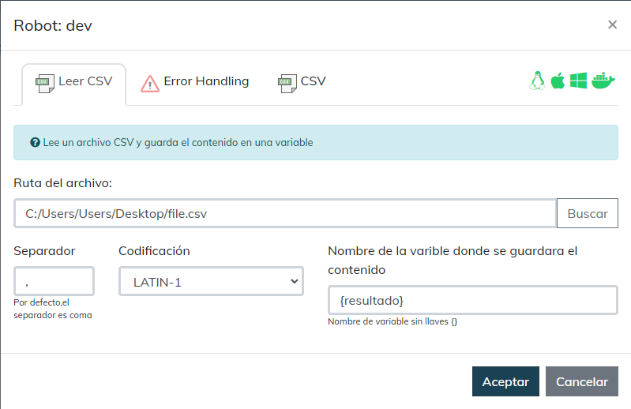
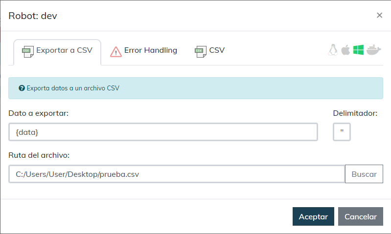
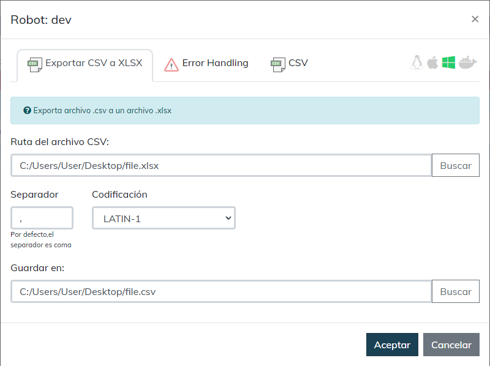

# CSV
  
Módulo para el manejo de archivos CSV  
  

## Como instalar este módulo
  
__Descarga__ e __instala__ el contenido en la carpeta 'modules' en la ruta de rocketbot.  

## Como usar este mmódulo

Ir al menú “Mods” y abrir el módulo “CSV”

## 1. Leer CSV
Para leer un archivo CSV, hacer click en **Leer CSV** y completar lo siguiente:

**Ruta del archivo:** Ruta del archivo CSV que se quiere leer.  
**Separador:** Separador del csv. Por defecto, el separador será por coma  
**Nombre de la variable donde guardar contenido**

## 2. Exprtar a CSV
Para exportar datos al formato CSV, hacer click en el comando **Exportar CSV** y completar lo siguiente:

**Dato a exportar:** Dato que sera exportado a CSV  
**Sperador:**  Separador del csv. Por defecto, el separador será por coma  
**Ruta del archivo:** Ruta donde se debe crear el archivo CSV  

## 3. Exportar CSV a XLSX
Para exportar un archivo CSV a XLS, hacer click en el comando **Exportar CSV a XLSX** y completar lo siguiente:

**Ruta del archivo CSV:** Ruta donde se encuentra el archivo CSV  
**Separador**: Separador del CSV. Por defecto, el separador sera por coma  
**Codificacion:** Codificacion que usara para exportar el archivo  
**Guardar en:** Ruta donde se guardara el archivo XLSX

## Descripción de los comandos

### Leer CSV
  
Lee un archivo CSV y guarda el contenido en una variable
|Parámetros|Descripción|ejemplo|
| --- | --- | --- |
|Ruta del archivo |Direccion del archivo que contiene los datos|C:/User/Usuario/Folder/file.csv|
|Separador|Caracter que separa los campos|,|
|Codificación|Codificación del archivo||
|Nombre de la varible donde se guardara el contenido|Nombre de la variable donde guardar resultado obtenido|Result|

### Exportar a CSV
  
Exporta datos a un archivo CSV
|Parámetros|Descripción|ejemplo|
| --- | --- | --- |
|Dato a exportar|Datos que seran exportados en un archivo CSV|[[data, data], [data, data]]|
|Delimitador|Delimitador de campos|,|
|Ruta del archivo|Ruta del archivo donde se guardarán los datos|C:/User/Usuario/Folder/file.csv|

### Exportar CSV a XLSX
  
Exporta archivo .csv a un archivo .xlsx
|Parámetros|Descripción|ejemplo|
| --- | --- | --- |
|Ruta del archivo CSV |Ruta donde se encuentra el archivo CSV|C:/User/Usuario/Folder/file.csv|
|Separador|Caracter separador|,|
|Codificación|Codificación del archivo||
|Guardar en |Ruta donde se guardará el archivo XLSX|C:/User/Usuario/Folder/file.xlsx|
